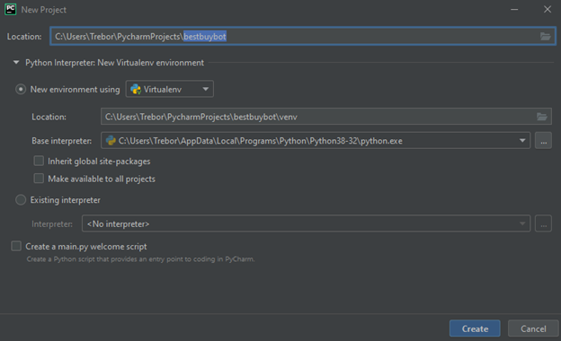
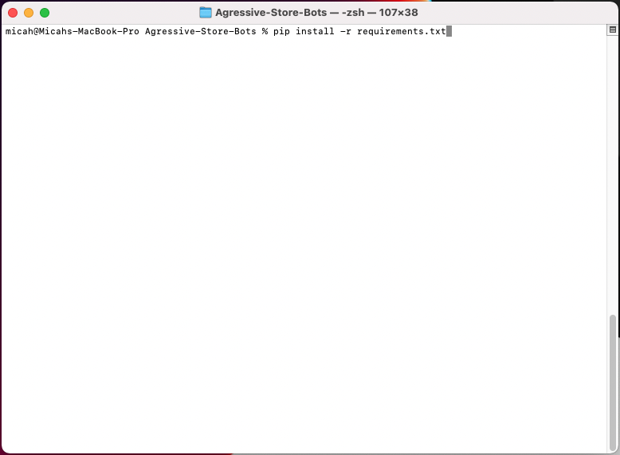
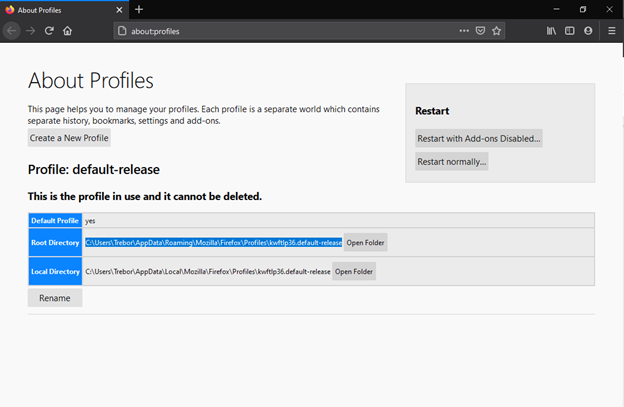

# How To Create A RTX 3080 Bot in Python

Hello GitHub, I would like to share my method of creating a aggressive Bestbuy Bot in Python. I will be using Beautifulsoup4, Selenium, and Twilio in this script. Please continue reading this for instructions on how to set up bot.

If you guys need instructions to set up Newegg Bot or Amazon Bot go to my Google Drive here.

[Newegg](https://docs.google.com/document/d/1xcjMNAdIkPhpz6msJqtGEPkikk-0FP5AB8ciKRa_OMY/edit?usp=sharing)

[Amazon](https://docs.google.com/document/d/1zYQ1W-htAN5aWVw5kMb5NLa7ZwZB47cwqNZao73eiK4/edit?usp=sharing)

**You can test bot with this URL.**

	https://www.bestbuy.com/site/searchpage.jsp?_dyncharset=UTF-8&id=pcat17071&iht=y&keys=keys&ks=960&list=n&qp=currentprice_facet%3DPrice~Less%20than%20%2425&sc=Global&st=hdmi&type=page&usc=All%20Categories
	
**Do Not Use a URL like this. If you compare both URL's you'll see the difference. Make sure URL looks like the page above. Otherwise bot will not work.**

	https://www.bestbuy.com/site/dynex-6-hdmi-cable-black/6405508.p?skuId=6405508

**1. Download Pycharm Community Edition & Firefox.**

[PyCharm Community Edition](https://www.jetbrains.com/pycharm/download)

[FireFox](https://www.mozilla.org/en-US/firefox/new/)

**2. Create a new project called bestbuybot and select create.**

**3. Go to terminal and type:**
1. `pip install beautifulsoup4`
2. `pip install selenium`
3. `pip install webdriver-manager`
4. `pip install twilio`

	

**4. Right click bestbuybot folder, and create new python file.**

**5. Copy and paste bestbuy aggressive bot script in that python file you just created.**

**6. Fill out the script with your personal information.**

	* Twilio Information(optional)

	* CVV number

	* Add your Firefox profile. To find Firefox profile type "about:profiles" in firefox. It is the Root Directory path.

**7. To run bot, click run then select bestbuy.**

